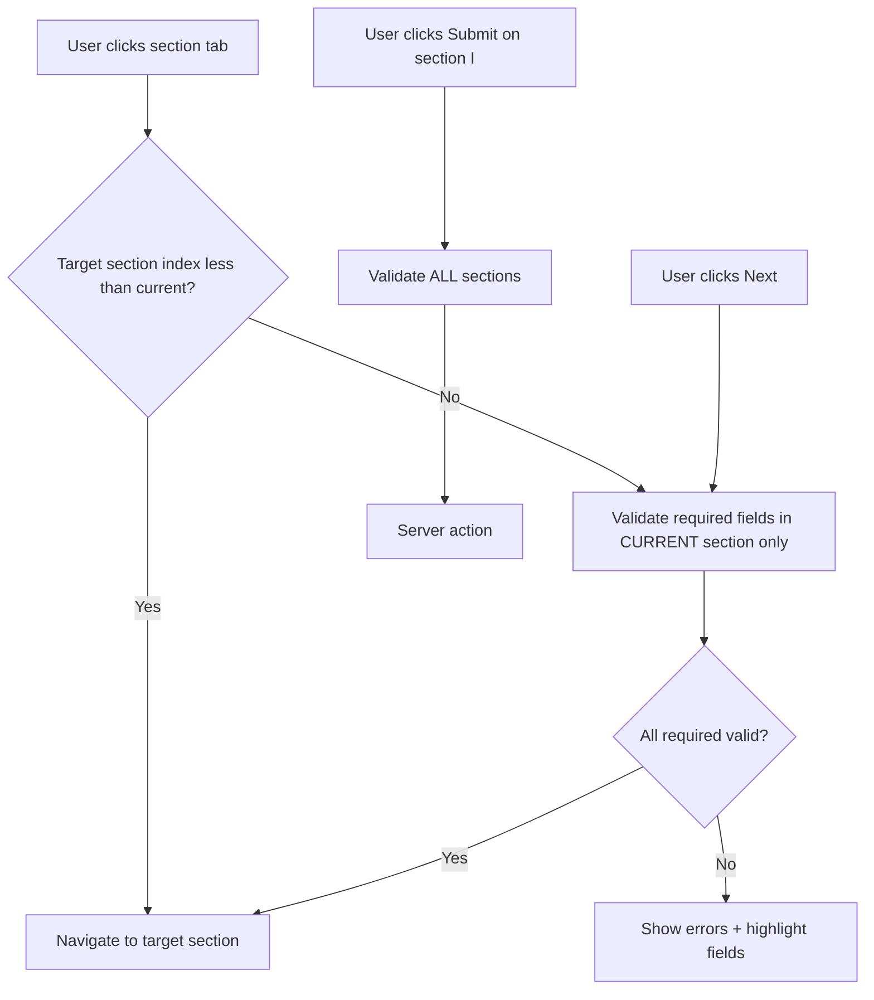
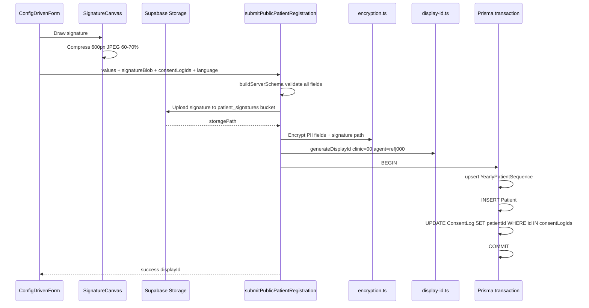

# Patient Registration Implementation Plan (Updated)

Spec source: [`next_steps_phase.md`](next_steps_phase.md)  
Config sources: [`lib/constants/patient_reg_form.ts`](lib/constants/patient_reg_form.ts), [`lib/constants/agent_reg_form.ts`](lib/constants/agent_reg_form.ts)  
Agreement files: [`public/agreements/*.md`](public/agreements/)

---

## Current State

**Ready:**
- [`patient_reg_form.ts`](lib/constants/patient_reg_form.ts) — 9 sections (A–I), all field definitions, helper exports
- [`agent_reg_form.ts`](lib/constants/agent_reg_form.ts) — 6 sections (A–F), mirrors patient UX patterns
- 7 Markdown agreement files in `public/agreements/`
- `ENCRYPTION_KEY` set in `.env`; `prisma generate` already run
- Survey form patterns: react-hook-form + dynamic Zod ([`survey-form.tsx`](components/survey/survey-form.tsx))

**Still missing (implementation work):**
- Prisma schema revamp ([`schema.prisma`](prisma/schema.prisma) still has minimal Patient/Agent)
- Encryption, display ID, Supabase Storage utilities
- Config-driven form UI, agreement modal, signature canvas
- Server actions for registration and consent logging
- Minor config key alignment (see below)

**Config alignment needed before/at start of UI work:**

| Issue | Location | Fix |
|-------|----------|-----|
| Spec requires `agreementFiles`; config uses `agreementPdfs` | `patient_reg_form.ts` L716, `agent_reg_form.ts` L569 | Rename to `agreementFiles` |
| Helpers reference `agreementFile` (singular) | `patient_reg_form.ts` L787–795 | Update to `agreementFiles` array |
| Agent Section D still uses `agreementPdf: "partner_terms_v1.pdf"` | `agent_reg_form.ts` L389–422 | Replace with `agreementFiles: ["/agreements/partner_agreement_v1.md"]` + `type: "checkbox"` |
| Agent Section D description mentions "View Agreement" | `agent_reg_form.ts` L378 | Remove per spec (checkbox click opens modal) |
| `FormField` type union missing `checkbox` in patient config | `patient_reg_form.ts` L84 | Add `'checkbox'` to type union |
| Shared `FormField` / `FormSection` types duplicated across both configs | Both files | Extract shared types to `lib/constants/form-types.ts` (optional refactor) |

---

## Prerequisites

### 1. Prisma schema (Phase 1 §1)

Extend [`prisma/schema.prisma`](prisma/schema.prisma):

```prisma
enum ConsentSource { DIGITAL PAPER }

model ConsentLog {
  id                String        @id @default(uuid())
  patientId         String?       // nullable — linked on submit if pre-logged
  agentId           String?
  documentType      String        // parsed from filename, e.g. "privacy_policy"
  version           String        // e.g. "v1"
  source            ConsentSource
  consentedAt       DateTime
  recordedAt        DateTime      @default(now())
  ipAddress         String?
  userAgent         String?
  staffId           String?
  physicalLocation  String?
  signatureImageUrl String?       // Supabase Storage path (encrypted in Patient record)
  staffDeclaration  Boolean       @default(false)
  patient           Patient?      @relation(...)
  agent             Agent?        @relation(...)
}

model YearlyPatientSequence {
  year    Int @id
  lastSeq Int @default(0)
}
```

**Patient model** — one column per `name` in config (snake_case), plus:
- `displayId String @unique`
- `clinicId String?`, `currentAgentId String?`
- `signatureImageUrl String?` (encrypted storage path)
- `digitizedBy String?`, `digitizedAt DateTime?`
- `source PatientSource @default(BOOKING)` for public registrations
- Consent boolean columns: `consent_info_accurate`, `consent_treatment_understanding`, `consent_comprehensive`, etc.
- Medical doc booleans: `has_medical_reports`, `has_lab_results`, etc.
- `medicalServices String[]` or `Json` for `medical_services[]` multi-select
- `assistanceRequired String[]` for `assistance_required[]`

**Agent model** — all fields from `agent_reg_form.ts` + `partnerId`, `status`, `email`, `passwordHash`, `commissionPercent`, etc.

Run migration after schema update.

### 2. New dependencies

- `react-markdown` — render agreement `.md` files in modal
- `@supabase/supabase-js` — Storage upload for signatures (bucket: `patient_signatures`)

### 3. Utility modules

| File | Responsibility |
|------|----------------|
| [`lib/utils/encryption.ts`](lib/utils/encryption.ts) | AES-256-CBC; key from `ENCRYPTION_KEY` (already in `.env`) |
| [`lib/utils/display-id.ts`](lib/utils/display-id.ts) | `generateDisplayId()`, `recomputeDisplayId()` — format `{clinic}-{agent}-{YY}{seq5}` |
| [`lib/utils/supabase-storage.ts`](lib/utils/supabase-storage.ts) | Upload compressed signature blob; return storage path |
| [`lib/utils/config-driven-form.ts`](lib/utils/config-driven-form.ts) | Shared helpers for both patient + agent configs |
| [`lib/utils/agreement-files.ts`](lib/utils/agreement-files.ts) | Parse `/agreements/privacy_policy_v1.md` → `{ documentType: "privacy_policy", version: "v1" }` |

### 4. Encryption field map (server-side, not in config)

Maintain a constant set aligned with spec — field `name` → encrypt before DB write:

```typescript
const ENCRYPTED_PATIENT_FIELDS = new Set([
  "passport_number", "passport_expiry",
  "mobile_number", "whatsapp", "line_id", "email",
  "street_address", "city", "state_province", "postal_code",
  "emergency_name", "emergency_phone", "emergency_email",
  "previous_treatment_description",
  // signature path encrypted after Supabase upload
]);
```

Unencrypted per spec: `full_name`, `preferred_name`, `date_of_birth`, `gender`, `nationality`, `country_of_residence`, medical service selections, travel fields, referral fields, consent booleans, medical doc checkboxes.

---

## 1. Structure of `patient_reg_form.ts` (As Built)

**Location:** [`lib/constants/patient_reg_form.ts`](lib/constants/patient_reg_form.ts)  
**Export:** `PATIENT_REGISTRATION_FORM: FormSection[]`

### Actual section map (A–I)

| Section ID | Letter | Title | Key fields |
|------------|--------|-------|------------|
| `personal_info` | A | Personal Information | `full_name`, `preferred_name`, `gender`, `date_of_birth`, `nationality`, `passport_number`, `passport_expiry`, `country_of_residence`, address block, `mobile_number`, `whatsapp`, `line_id`, `email` |
| `emergency_contact` | B | Emergency Contact | `emergency_name`, `emergency_relationship`, `emergency_phone`, `emergency_email` |
| `medical_service` | C | Requested Medical Service | `service_category` + conditional `medical_services[]` checkboxes, `medical_services_other` |
| `healthcare_info` | D | Healthcare Information | `previous_treatment`, `previous_treatment_description`, `under_physician_care`, `physician_name`, `physician_country` |
| `medical_records` | E | Medical Records | `has_medical_reports`, `has_lab_results`, `has_imaging`, `has_medication_list`, `has_referral_letter`, `has_surgical_records`, `has_other_medical_docs` — **checkbox only, no upload** |
| `telemedicine` | F | Telemedicine Consultation | `want_telemedicine`, `telemedicine_language`, `preferred_consultation_time` |
| `travel_info` | G | Travel Information | `preferred_travel_month`, `estimated_stay`, `travel_with_companion`, `companion_count`, `assistance_required[]` |
| `referral_info` | H | Referral Information | `referral_source`, `partner_name`, `partner_id` (read-only when `?ref=` present) |
| `consent` | I | Consent & Signature | `use_master_signature`, simple consent checkboxes, `consent_comprehensive` (4 agreement files), `signature_name`, `signature_data` (canvas), `consent_date` |

### FormField type (as defined)

```typescript
interface FormField {
  name: string;           // DB column (snake_case)
  type: 'text' | 'email' | 'tel' | 'date' | 'select' | 'checkbox-group'
      | 'radio' | 'textarea' | 'heading' | 'number' | 'signature' | 'checkbox';
  label: Record<SupportedLanguage, string>;
  placeholder?: Record<SupportedLanguage, string>;
  required?: boolean;
  options?: Array<{ value: string; label: Record<SupportedLanguage, string> }>;
  conditional?: { field: string; value: string | boolean };
  colSpan?: number;
  value?: string;         // checkbox-group single-value mode
  compressWidth?: number;   // signature: 600
  compressQuality?: number; // signature: 70
  agreementFiles?: string[]; // e.g. ["/agreements/privacy_policy_v1.md", ...]
}
```

### Existing helpers (to extend)

- `getAllSections()`, `getAllFields()`, `getSectionById(id)`
- `getDefaultValues()` — used for react-hook-form defaults
- **Fix:** `getFieldsWithAgreement()` / `getConsentFields()` — filter fields where `agreementFiles?.length > 0`

### Agent form (shared patterns)

[`agent_reg_form.ts`](lib/constants/agent_reg_form.ts): 6 sections A–F  
- Section D (`professional_standards`) — 5 standards checkboxes (needs `agreementFiles` update)  
- Section F (`additional_info`) — master signature + `declaration_compliance_agreement` with 4 agreement files  
Same UI components, different config import.

---

## 2. Section-Tab Navigation (Not 4-Step Groups)

Per **Phase 1 §8** in [`next_steps_phase.md`](next_steps_phase.md), navigation uses **section letter tabs**, not the old 4-step grouping.

### Tab bar

Patient form: `[A] [B] [C] [D] [E] [F] [G] [H] [I]`  
Agent form: `[A] [B] [C] [D] [E] [F]` (derived from `PATIENT_REGISTRATION_FORM.length` / section index)

Each tab maps 1:1 to a `FormSection` in the config array (index 0 = A, etc.).

### Navigation rules



- **Forward / future tab:** validate current section; block with message if incomplete
- **Backward / previous tab:** no validation; allow free editing
- **Next button:** same as clicking the next tab
- **Submit:** only on final section (I for patient, F for agent); validate entire form

### Section status indicators

Each tab shows one of:
- **Active** — gold border / highlighted (current section)
- **Complete** — green checkmark (all required fields in section valid + filled)
- **Incomplete** — empty/red dot (required fields missing)

Status computed from react-hook-form `formState.errors` + `watch()` for each section's field list (derived from config, not hardcoded).

### Component architecture

```
components/config-driven-form/
  config-driven-form.tsx       # Shared orchestrator (patient + agent)
  section-tab-bar.tsx          # A–I tabs + status indicators
  field-renderer.tsx           # Switch on field.type
  agreement-modal.tsx          # Markdown sequential consent flow
  signature-canvas.tsx         # HTML5 canvas, touch + mouse, client compress
  master-signature-checkbox.tsx
  form-language-selector.tsx

app/register/page.tsx
app/partner/register/page.tsx
app/dashboard/patients/new/page.tsx   # mode="staff"
```

**Zero hardcoded field names** in UI — all from config via `getAllFields()` / `getSectionById()`.

### Conditional fields

Render when `field.conditional` matches current form values:
- e.g. `service_category === "category_0"` shows matching `medical_services[]` items
- e.g. `previous_treatment === "yes"` shows `previous_treatment_description`
- Required validation applies only when field is visible

### URL referral prefill

[`app/register/page.tsx`](app/register/page.tsx): read `?ref=XXXX` → set `partner_id` default + `readOnly`  
Server on submit: lookup `Agent.partnerId === ref && status === ACTIVE` → set `currentAgentId`

---

## 3. Server Action Flow: Encryption & Display ID

### Action files

| File | Exports |
|------|---------|
| [`lib/actions/patient-registration.ts`](lib/actions/patient-registration.ts) | `submitPublicPatientRegistration`, `submitStaffPatientRegistration` |
| [`lib/actions/agent-registration.ts`](lib/actions/agent-registration.ts) | `submitAgentRegistration` |
| [`lib/actions/consent.ts`](lib/actions/consent.ts) | `recordAgreementConsent` |

### Public patient submission flow



### Step-by-step

1. **Validate** — `buildServerPatientRegSchema(PATIENT_REGISTRATION_FORM).safeParse(input)`

2. **Upload signature** — client sends compressed base64/blob; server uploads to Supabase bucket `patient_signatures`, encrypts returned path for `signatureImageUrl` on Patient

3. **Resolve agent** — if `partner_id` / `?ref=` present, lookup active agent; set `currentAgentId` or leave null if invalid (save code as entered)

4. **Encrypt** — loop `ENCRYPTED_PATIENT_FIELDS`; AES-256-CBC with random IV, base64 store

5. **Display ID** — `{clinicCode}-{agentCode}-{YY}{seq5}`:
   - No clinic/agent at registration: `00-000-260001`
   - Atomic yearly sequence via `YearlyPatientSequence` upsert in transaction

6. **Map fields** — each config `field.name` → Patient column; arrays (`medical_services[]`, `assistance_required[]`) → JSON/array columns

7. **Link consent logs** — update pre-created `ConsentLog` rows with `patientId` (see §4)

8. **Staff digitization** — `submitStaffPatientRegistration`:
   - `requireAuth()`; extra fields: `signature_date`, paper signature upload, `physical_location`, `staff_declaration`
   - ConsentLog `source: PAPER`, `staffId`, `digitizedBy`, `digitizedAt` on Patient
   - Same form config + `mode="staff"` overlays staff-only fields via separate staff field extensions in config or props

9. **Return** — `{ success: true, displayId }` shown on success page

### Display ID auto-update (Phase 1 §7)

When admin assigns `clinicId` or `currentAgentId`: call `recomputeDisplayId()` — update prefix only, **keep same sequence suffix**.

### Decryption

Server-only `decryptPatientFields()` in authenticated reads (`getPatientById`); never expose raw ciphertext to client.

---

## 4. Consent Logging Logic

### Two consent categories

| Category | Fields | Logging |
|----------|--------|---------|
| **Simple checkbox** | `consent_info_accurate`, `consent_treatment_understanding`, declaration fields | Boolean on Patient/Agent; no agreement modal; logged on submit only if needed |
| **Agreement checkbox** | `consent_comprehensive` (patient), `declaration_compliance_agreement` (agent) | Modal with sequential Markdown files; **one ConsentLog per file per "I Agree" click** |

### Agreement modal UX (Phase 1 §3)

Triggered **only by checkbox click** — no separate "View Agreement" button.

1. User clicks agreement checkbox → modal opens immediately with File 1 of N
2. Header: `Privacy Policy (1 / 4)`
3. Body: fetch `/agreements/privacy_policy_v1.md`, render with `react-markdown`
4. Button: `I Agree & Next →` (files 1..N-1) or `I Agree & Close` (file N)
5. Each "I Agree" click → call `recordAgreementConsent` server action
6. Close modal without completing → checkbox stays **unchecked**
7. Uncheck + re-check → modal restarts from file 1; prior session consents for that checkbox invalidated client-side (new ConsentLog entries on re-agree)

### `recordAgreementConsent` server action

Called on each "I Agree" click (before final form submit):

```typescript
// Input
{
  documentPath: "/agreements/privacy_policy_v1.md",
  source: "DIGITAL",
  consentedAt: ISO string,
  signatureImageUrl?: string,  // if use_master_signature checked
  formType: "patient" | "agent",
}

// Creates ConsentLog with:
// - patientId: null, agentId: null (linked on final submit)
// - documentType + version parsed from filename
// - ipAddress, userAgent from headers()
// - signatureImageUrl if master signature already uploaded
// Returns: { consentLogId }
```

Client accumulates `consentLogIds[]` per agreement checkbox field.

**Checkbox tick rule:** field checkbox becomes checked **only when** client-held `consentLogIds.length === field.agreementFiles.length` for that field.

### Master signature flow

1. User draws on canvas (`signature_data` field) → compress client-side (600px, JPEG 60–70%, 30–100KB)
2. Optional: `use_master_signature` checkbox — when checked, same signature URL attached to all subsequent ConsentLog entries
3. Upload occurs at final submit (or on first consent agree if master signature checked early — upload once, reuse path)

### Final submit linking

In registration transaction:
```typescript
await tx.consentLog.updateMany({
  where: { id: { in: consentLogIds } },
  data: { patientId: patient.id },
});
```

Also persist consent booleans on Patient record for quick queries.

### Paper consent (staff digitization)

On staff submit, for agreement fields:
- `source: PAPER`
- `staffId`, `physicalLocation`, `staffDeclaration: true`
- Paper signature image → Supabase Storage → encrypted path
- `consentedAt` from staff "Date of Signature" field
- No agreement modal replay; staff confirms witness checkbox

### Agent registration

Identical modal/signature UX; ConsentLog uses `agentId` (linked after Agent create with status PENDING).

---

## 5. Agreement Files Reference

| Form field | agreementFiles |
|------------|----------------|
| Patient `consent_comprehensive` | `privacy_policy_v1.md`, `data_transfer_v1.md`, `telemedicine_informed_consent_v1.md`, `booking_refund_policy_v1.md` |
| Agent `declaration_compliance_agreement` | `partner_agreement_v1.md`, `refer_ownership_policy_v1.md`, `commission_policy_v1.md`, `code_of_conduct_v1.md` |

Agent Section D standards checkboxes: align to single shared agreement file or simple checkboxes (no modal) — update config during alignment task.

---

## Implementation Sequence

1. **Schema migration** — Patient, Agent, ConsentLog, YearlyPatientSequence, enums
2. **Config alignment** — `agreementFiles` key, fix helpers, agent Section D
3. **Utilities** — encryption, display-id, supabase-storage, agreement-files parser
4. **Validation** — dynamic Zod from config (client + server)
5. **Consent action** — `recordAgreementConsent`
6. **Shared UI** — SectionTabBar, FieldRenderer, AgreementModal, SignatureCanvas, ConfigDrivenForm
7. **Patient registration action + `/register` page**
8. **Staff digitization** — `/dashboard/patients/new` reuse
9. **Agent registration action + `/partner/register`**
10. **Consents tab** on patient detail (Phase 1 §5)

---

## Testing Checklist

- Section tabs A–I render from config; status indicators update correctly
- Forward tab blocked when required fields empty; backward tab always allowed
- `?ref=ZA1W` pre-fills + locks `partner_id`
- Agreement modal: sequential Markdown render; checkbox only ticks after all files agreed
- Each "I Agree" creates ConsentLog; linked to Patient on submit
- Canvas signature compresses; uploads to Supabase; path encrypted in DB
- Master signature checkbox applies same URL to all consent logs
- Encrypted fields stored as ciphertext; plaintext fields readable
- Display ID `00-000-YYnnnnn` at registration; prefix updates on clinic/agent assign
- Section E medical doc checkboxes save booleans; no file upload anywhere
- Staff paper form creates PAPER consent logs with staff metadata
- Agent form at `/partner/register` creates PENDING agent with same UX patterns

---

## Resolved Decisions (from updated spec)

- **Signature storage:** Supabase Storage bucket `patient_signatures` only (no Cloudinary, no DB blob)
- **Agreements:** Markdown in `/public/agreements/`, rendered with `react-markdown`
- **Medical records:** Checkbox only — no upload, no DMS
- **Profile photo:** Not included
- **Navigation:** Section tabs A–I with per-section forward validation (not 4 grouped steps)
- **ConsentLog:** Supports both `patientId` and `agentId` (nullable until linked)
